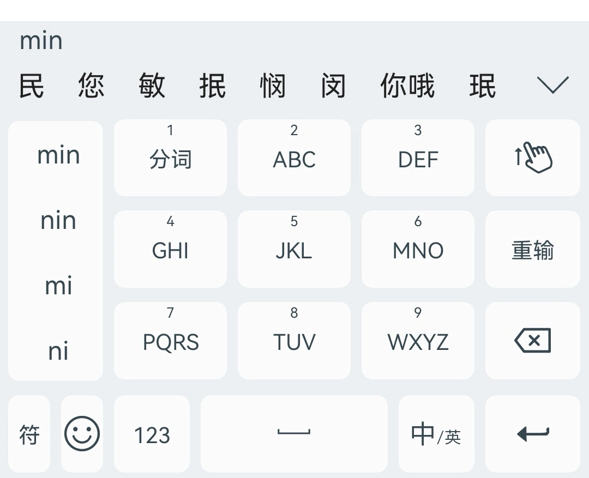
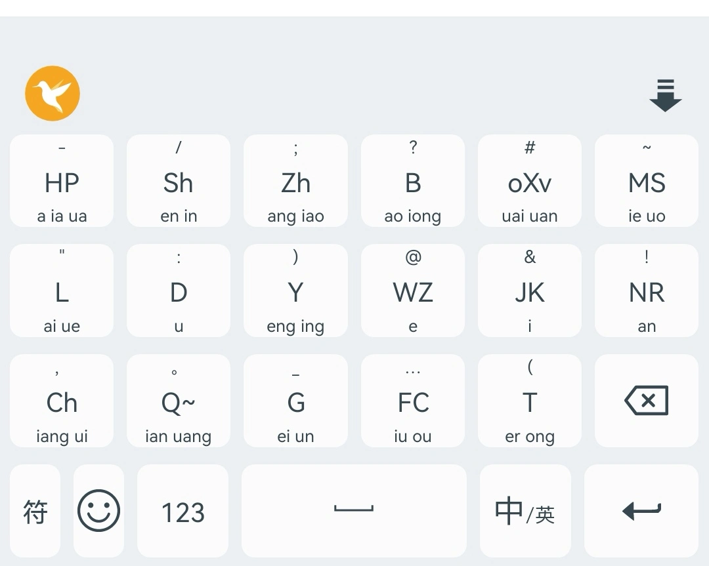
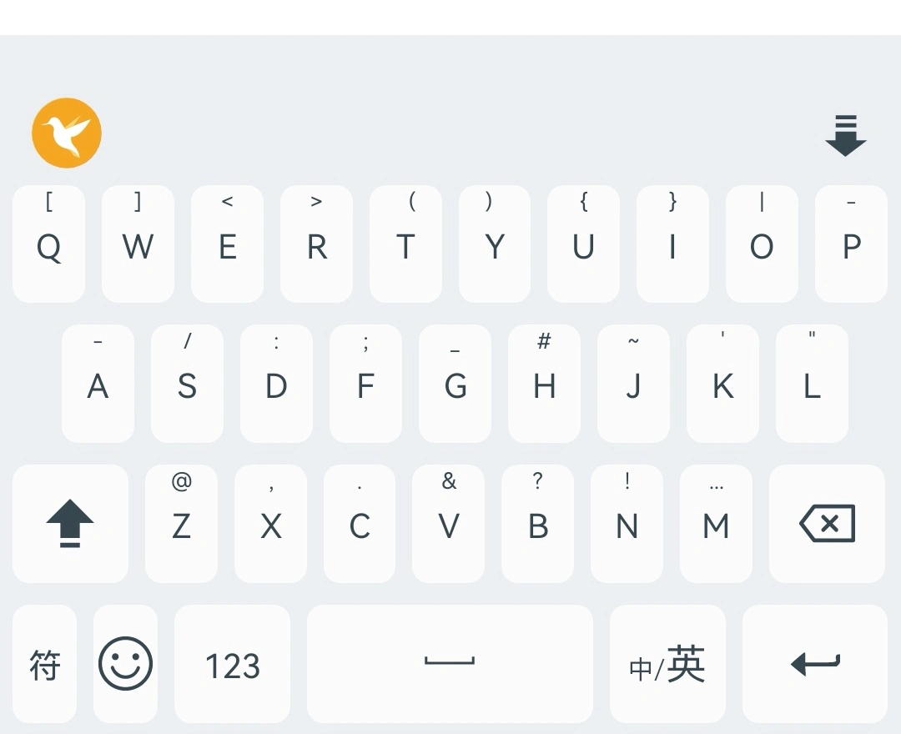
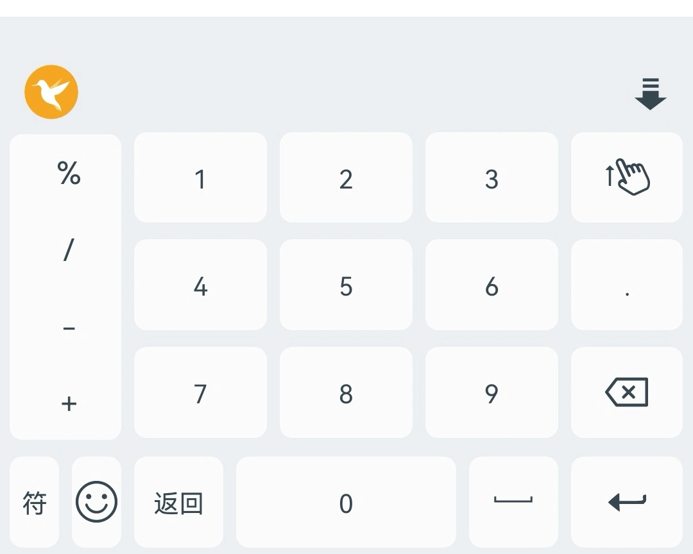
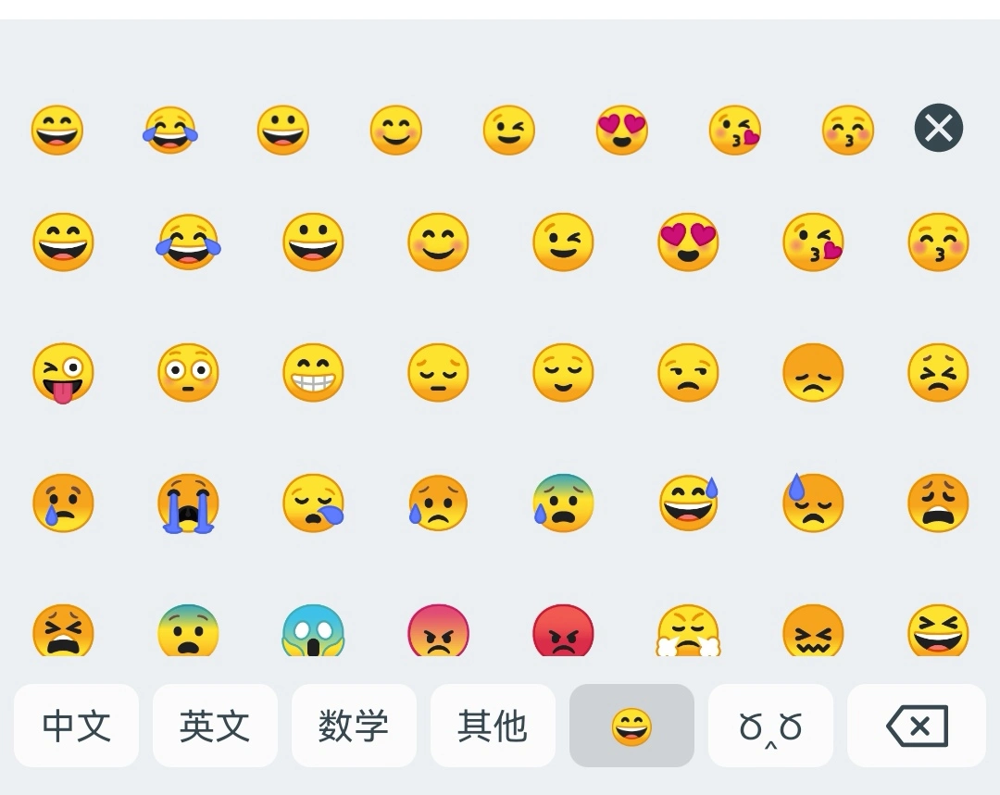
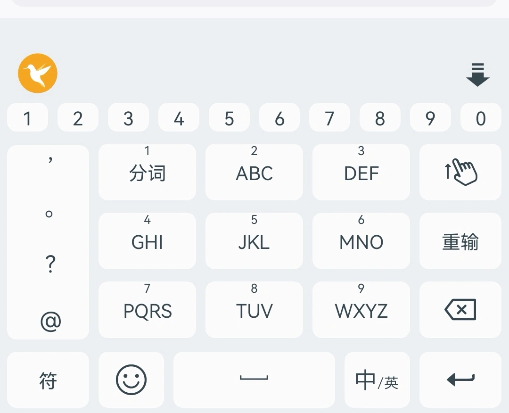
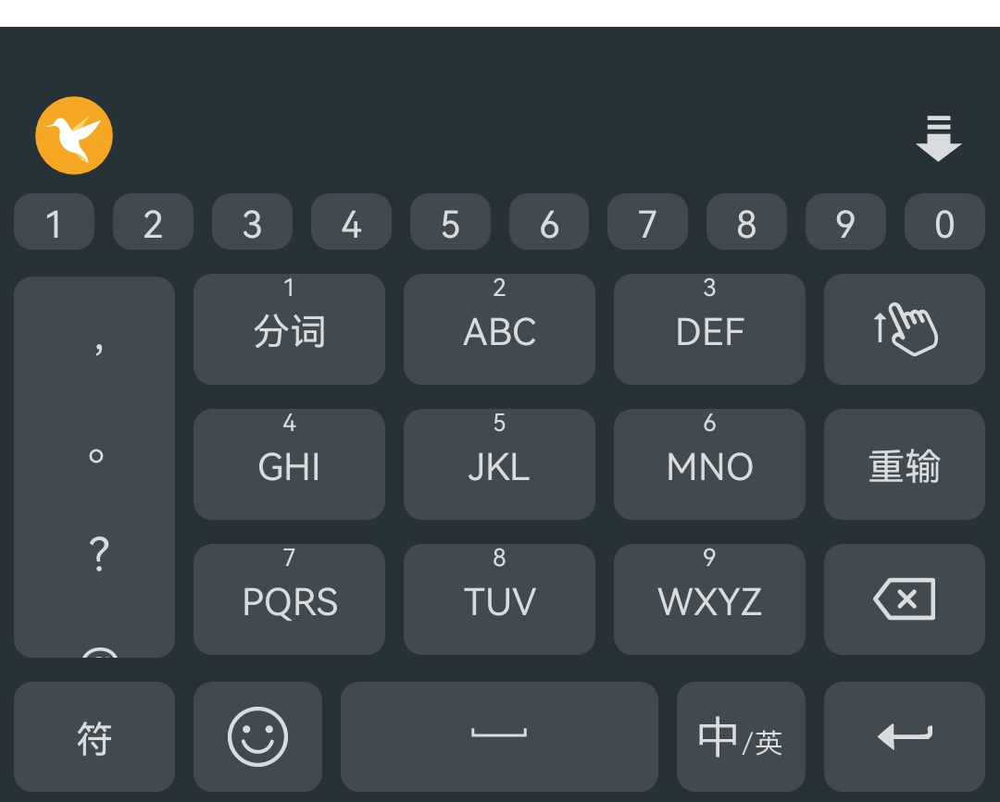
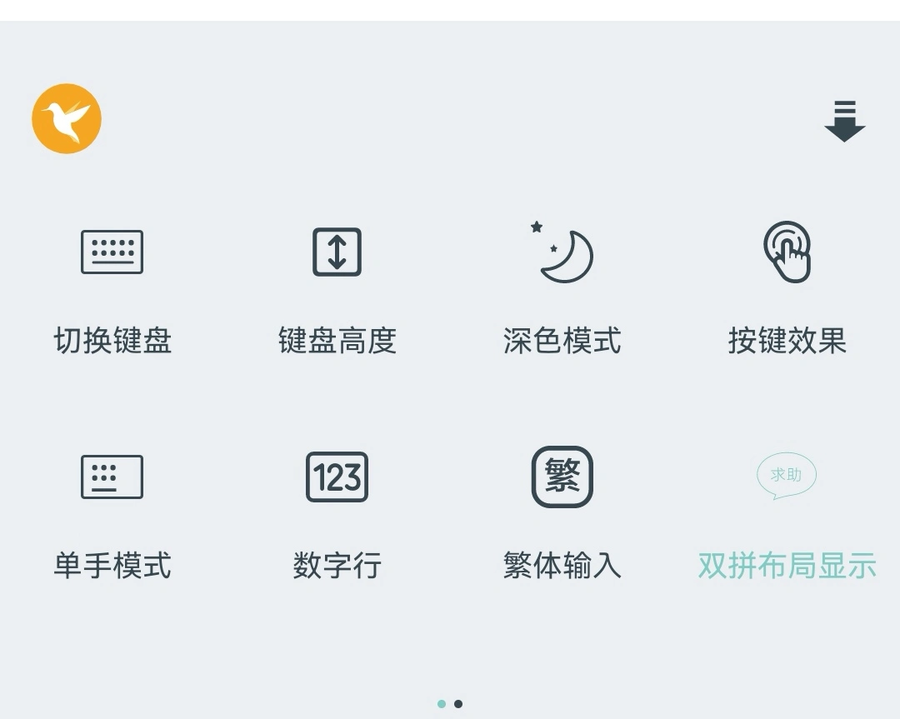
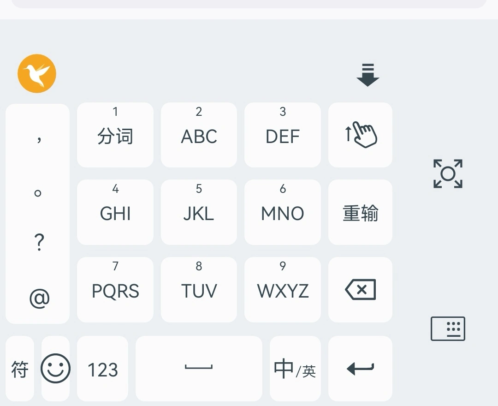
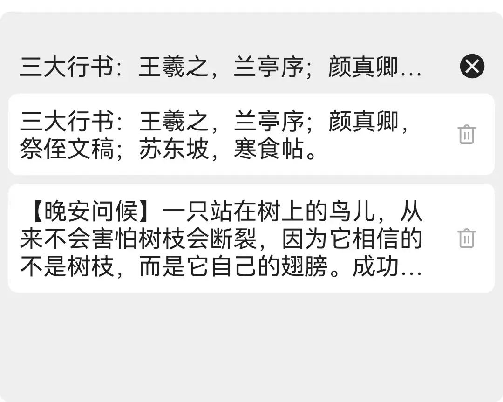

# 雨燕输入法
雨燕作为鸟类，以其敏捷、优雅的飞行姿态，在雨天依然够飞翔、不畏艰险、勇往直前的飞翔态度，被赋予**灵巧、聪明、伶俐、积极、创新**的寓意。语言是人类交流的基本工具，是最重要的文化载体，输入方式是语言交流和信息传递的重要环节，使语言交流变得更加**高效、便捷**。  
[雨燕输入法](https://github.com/gurecn/YuyanIme)秉承这些特点，以“**易用、快速、准确**”为核心理念，追求极致、卓越、流畅的输入体验。 在设计上，雨燕输入法借鉴主流的谷歌拼音、微信输入法等主流输入法精华，追求整体简洁大方，易于上手。支持多种输入方式，规划包括拼音、手写、语音等，满足不同用户的输入需求。支持丰富的个性化设置选项，用户可以根据自己的喜好进行自定义设置，让输入更加符合个人习惯。
## 安装使用：
点击[Releases](https://github.com/gurecn/YuyanIme/releases)，下载最新版本安装包直接安装使用即可。debug、release版本均可直接安装，建议使用release版本。  
使用过程中任何问题可以创建issues或通过邮件等方式反馈，本人会根据需求及时修复。
## 设计原则：
### 纯输入功能，主打轻快。
喜欢简洁的我看到一个个拼音输入法工具软件逐渐趋向繁杂，软件内各种眼花缭乱的无用功能以及烦人的广告让我无法忍受。  
**因此我想要定制出一款简洁、实用、好用的输入法；**
### 不联网、不获取任何权限，更安全。
当前主流输入法获取各类非必要权限，无视用户隐私，随意上传、分析用户数据。虽然大数据不会区别对待，但我仍然希望自己的数据只在自己的手机里，不要在我不知情、无意识的情况下，把所有数据上传。  
**雨燕输入法不获取任何系统权限，完全离线不上传云端，输入数据不采集、不记录，不访问任何个人、终端、位置、存储等信息，只为输入而存在，纯净、安全、更高效。**
### 基于Rime引擎，但更易上手。
当前开放的输入法引擎中，[Rime引擎](https://github.com/rime/librime)已经趋向完善。然后对于小白用户来说，上手却并不容易：各种输入方案定制及兼容问题，各种键盘的界面效果优化问题。  
**因此我想要定制出一款基于Rime引擎的安装即用，哪怕没时间研究也能好用的输入法；**
### 输入模式更完善。
最早接触安卓平台的[同文输入法](https://github.com/osfans)，后面接触[小企鹅输入法](https://github.com/fcitx5-android/fcitx5-android)，均采用Rime方案进行定制，在输入层面已经满足大部分需求。但是小企鹅输入法九宫格键盘不支持，同文输入法候选词选择不便且无法选择拼音组合，使用起来确实需要勇气。  
**因此我想定制出一款支持对小白用户来说使用更普及的九宫格，同时结合全键、双拼、手写、语音等多种方案的输入法。**  
### 个性化定制更贴心。
手机屏幕越来越大，但是在走路时，一手提东西，一手打字回复消息对我来说是个头疼地问题，选择候选词够不到、选择出错屡屡出现，因此我定制了单手模式、悬浮键盘。  
输入数字要么切换到数字键盘，要么长按按键输入，对输入来说都不便捷，因此我定制了键盘数字行。  
夜间输入时，屏幕刺眼，因此我定制了深色主题自动切换功能。更多贴心定制项正在进行中。。。。  

**基于以上几点原则，创建了该项目并进行持续更新迭代。**  

**~~由于项目中一些不便开源的代码，防止出现非必要的纠纷，核心SDK部分暂时闭源，后续根据情况，在时机成熟后进行调整、开源~~** 。
**更新：2024.07.17：当前核心SDK部分已经开源，所有人可以参与、参考、借鉴项目代码** 。

## 实现功能：
+ 拼音输入：九宫格、拼音全键、手写键盘（汉王手写功能到期，暂未续费）、小鹤双拼、乱序17双拼；支持简拼、全拼；
+ 英文输入：智能全键英文输入； 
+ 符号输入：中文、英文、数学、颜文字、EMOJI表情输入；
+ 数字输入：数字键盘输入、键盘数字行输入； 
+ 键盘自定义：自定义主题、深色模式、键盘高度、键盘数字行； 
+ 单手键盘：左、右手模式切换；
+ 悬浮键盘：悬浮键盘模式，键盘拖拽、移动；
+ 花漾字输入：火星文（焱暒妏）、 花藤字（ζั͡花ั͡藤ั͡字ั͡✾）、凌乱字（"҉҉҉凌҉҉҉乱҉҉҉字҉҉҉）、发芽字（发ོ芽ོ字ོ）、雾霾字（҈҈҈҈雾҈҈҈҈霾҈҈҈҈字҈҈҈҈）、禁止查看（禁⃠止⃠查⃠看⃠）、长草字（"҈长҉҉҈草҉҉҈字҉）、起风了（=͟͟͞͞风=͟͟͞͞太=͟͟͞͞大=͟͟͞͞）花漾输入； 
+ 拼音输入扩展：支持繁体、简体，支持中英文混输，支持表情描述输入；
+ 剪切板键盘：支持剪切板联想显示、剪切板删除操作。

## 规划功能：
* 联想词功能；
* 横屏分栏键盘；
* 动态键盘背景；
* 离线语音识别；
* 离线手写输入；
* 英文滑动输入；
* 光标操作键盘；
* 智能纠错显示。

## 已知问题：
* 小米手机中键盘菜单点击设置等无反应:  
  由于小米手机中键盘跳转应用界面需借助`后台弹出界面`权限，该权限需用户手动开启：设置-应用管理-雨燕输入法-权限管理-开启`后台弹出界面`权限即可。

## 运行环境：
> gradle:8.2.0  
> kotlin-gradle-plugin:1.9.22  
> kotlin-serialization:1.9.22  
> Android minSdk：23  
> Android targetSdk：34  
> JDK: penjdk version "17.0.11" 2024-04-16

## 构建项目：
### 1. 克隆此项目并拉取所有子模块。
```sh
git clone git@github.com:gurecn/YuyanIme.git
git submodule update --init --recursive
```
### 2. 导入Android Studio
建议使用最新、稳定版本，本人使用`Android Studio Iguana | 2023.2.1 Patch 1`版本，按照常规项目导入即可，`Android Studio`会自动安装并配置 Android 开发环境。

## 键盘预览：
* 九宫格拼音键盘
  
* 乱序17拼音键盘
  
* 英文键盘
  
* 数字键盘
  
* 表情键盘
  
* 键盘数字行
  
* 主题深色模式
  
* 设置键盘
  
* 键盘单手模式
  
* 悬浮键盘模式
  
* 剪切板键盘模式
  

## 鸣谢：
项目中借鉴部分第三方组件或服务：
- [同文输入法](https://github.com/osfans)
- [小企鹅输入法](https://github.com/fcitx5-android/fcitx5-android)
- [RIME](http://rime.im)
- [🍀四叶草拼音输入方案](https://github.com/fkxxyz/rime-cloverpinyin)
- [雾凇拼音方案](https://github.com/iDvel/rime-ice)


## 联系作者：
访问我的资源: <a href="https://github.com/gurecn">https://github.com/gurecn</a>  
  
访问我的博客：<a href="http://www.emzz.cn/">http://www.emzz.cn/</a>  

给我发送邮箱：[gurecn@163.com](mailto:gurecn@163.com)


