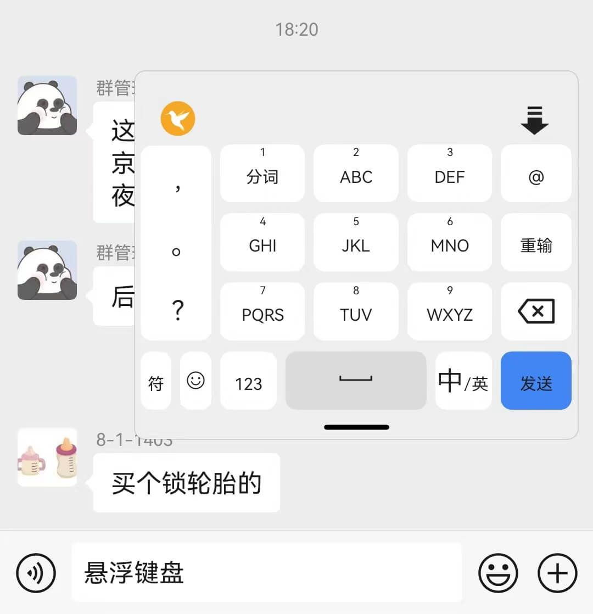

# 雨燕输入法
雨燕作为鸟类，以其敏捷、优雅的飞行姿态，在雨天依然够飞翔、不畏艰险、勇往直前的飞翔态度，被赋予**灵巧、聪明、伶俐、积极、创新**的寓意。语言是人类交流的基本工具，是最重要的文化载体，输入方式是语言交流和信息传递的重要环节，使语言交流变得更加**高效、便捷**。
[雨燕输入法](https://github.com/gurecn/YuyanIme)秉承这些特点，以“**易用、快速、准确**”为核心理念，追求极致、卓越、流畅的输入体验。 在设计上，雨燕输入法借鉴主流的谷歌拼音、微信输入法等主流输入法精华，追求整体简洁大方，易于上手。支持多种输入方式，规划包括拼音、手写、语音等，满足不同用户的输入需求。支持丰富的个性化设置选项，用户可以根据自己的喜好进行自定义设置，让输入更加符合个人习惯。
## 设计原则：
### 纯输入功能，主打轻快。
喜欢简洁的我看到一个个拼音输入法工具软件逐渐趋向繁杂，软件内各种眼花缭乱的无用功能以及烦人的广告让我无法忍受。因此我想要定制出一款简洁、实用、好用的输入法；
### 不联网、不获取任何权限，更安全。
雨燕输入法不获取任何系统权限，完全离线不上传云端，输入数据不采集、不记录，不访问任何个人、终端、位置、存储等信息，只为输入而存在，纯净、安全、更高效。
### 基于Rime引擎，但更易上手。
当前开放的输入法引擎中，[Rime引擎](https://github.com/rime/librime)已经趋向完善。然后对于小白用户来说，上手却并不容易：各种输入方案定制及兼容问题，各种键盘的界面效果优化问题。因此我想要定制出一款安装即用的输入法；
### 输入模式更完善。
最早接触安卓平台的[同文输入法](https://github.com/osfans)，后面接触[小企鹅输入法](https://github.com/fcitx5-android/fcitx5-android)，均采用Rime方案进行定制，在输入层面已经满足大部分需求。但是小企鹅输入法九宫格键盘不支持、同文输入法候选词选择不便。因此我想定制出一款对使用更普及的九宫格键盘以及全键盘、双拼、手写、语音等多种方案均支持的输入法。
基于以上几点原则，创建了该项目并进行更新迭代。
### 个性化定制更贴心。
手机屏幕越来越大，但是在走路时，一手提东西，一手打字回复消息对我来说是个头疼地问题，选择候选词够不到、选择出错屡屡出现，因此我定制了单手模式、悬浮键盘。
输入数字要么切换到数字键盘，要么长按按键输入，对输入来说都不便捷，因此我定制了键盘数字行。
夜间输入时，屏幕刺眼，因此我定制了深色主题自动切换功能。更多贴心定制项正在进行中。。。。

**由于项目中一些不便开源的代码，防止出现非必要的纠纷，核心SDK部分暂时闭源，后续根据情况进行调整、开放** 。

## 实现功能：
+ 拼音输入：九宫格、拼音全键、手写键盘（汉王手写功能到期，暂未续费）、小鹤双拼、乱序17双拼；支持简拼、全拼；
+ 英文输入：智能全键英文输入； 
+ 符号输入：中文、英文、数学、颜文字、EMOJI表情输入；
+ 数字输入：数字键盘输入、键盘数字行输入； 
+ 键盘自定义：自定义主题、深色模式、键盘高度、键盘数字行； 
+ 单手键盘：左、右手模式切换；
+ 悬浮键盘：悬浮键盘模式，键盘拖拽、移动；
+ 花漾字输入：火星文（焱暒妏）、 花藤字（ζั͡花ั͡藤ั͡字ั͡✾）、凌乱字（"҉҉҉凌҉҉҉乱҉҉҉字҉҉҉）、发芽字（发ོ芽ོ字ོ）、雾霾字（҈҈҈҈雾҈҈҈҈霾҈҈҈҈字҈҈҈҈）、禁止查看（禁⃠止⃠查⃠看⃠）、长草字（"҈长҉҉҈草҉҉҈字҉）、起风了（=͟͟͞͞风=͟͟͞͞太=͟͟͞͞大=͟͟͞͞）花漾输入； 
+ 拼音输入扩展：支持繁体、简体，支持中英文混输，支持表情描述输入；

## 规划功能：
* 粘贴板键盘；
* 联想词功能；
* 横屏键盘切换；
* 动态键盘背景；
* 离线语音识别；
* 离线手写输入；
* 英文滑动输入；

## 键盘预览
* 九宫格拼音键盘

* 乱序17拼音键盘

* 英文键盘

* 数字键盘

* 表情键盘

* 键盘数字行

* 主题深色模式

* 设置键盘

* 键盘单手模式

* 悬浮键盘模式

## 鸣谢：
项目中借鉴部分第三方组件或服务：
- [同文输入法](https://github.com/osfans)
- [小企鹅输入法](https://github.com/fcitx5-android/fcitx5-android)
- [RIME](http://rime.im)
- [🍀四叶草拼音输入方案](https://github.com/fkxxyz/rime-cloverpinyin)
- [雾凇拼音方案](https://github.com/iDvel/rime-ice)

## 运行环境：
> gradle:8.2.0
> kotlin-gradle-plugin:1.9.22
> kotlin-serialization:1.9.22
> Android minSdk：23
> Android targetSdk：34

